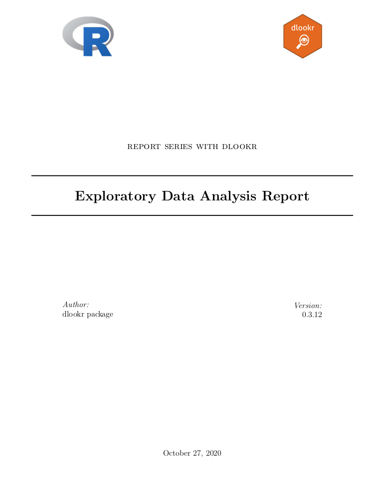

## Install required packages

```{r}
install.packages("partykit")
install.packages("dlookr")
install.packages("dplyr")
install.packages("ggplot2")
```

## Import required packages

```{r environment, echo=FALSE, message=FALSE, warning=FALSE}
knitr::opts_chunk$set(collapse = TRUE, comment = "")
options(tibble.print_min = 4L, tibble.print_max = 4L)
library(partykit)
library(dlookr)
library(dplyr)
library(ggplot2)
```

## Import automobile data set 

```{r}
df<- read.csv(file ='Automobile_data.csv')
str(df)
```

## Convert all the categorical data to numeric

```{r}
df = data.matrix(df)
df = data.frame(df)
```

## Create missing values

```{r}
set.seed(123)
df[sample(seq(NROW(df)), 20), "convertible"] <- NA

set.seed(456)
df[sample(seq(NROW(df)), 10), "front"] <- NA
```

## Calculating descriptive statistics using `describe()`

```{r}
describe(df)
```

The following explains the descriptive statistics only for a few selected variables :

```{r}

# Select columns by name
describe(df, X3,X88.6,X168.8)

# Select all columns between X3 and X13495 (inclusive)
describe(df, X3:X13495)
# Select all columns except X3(inclusive)
describe(df, -X3)
```

By using dplyr, You can sort by `left or right skewed size`(skewness) :

```{r}

df %>%
  describe() %>%
  select(variable, skewness, mean, p25, p50, p75) %>% 
  filter(!is.na(skewness)) %>% 
  arrange(desc(abs(skewness)))
```

The `describe()` function supports the `group_by()` function syntax of `dplyr` :

```{r}
df %>%
  group_by(front) %>% 
  describe(gas, two) 
```

```{r}

df %>%
  group_by(front,alfa.romero) %>% 
  describe(gas, two) 
```

## Test of normality on numeric variables using `normality()`

```{r}

normality(df)
```

The following example performs a normality test on only a few selected variables.

```{r}

# Select columns by name
normality(df, X3, X88.6, four)

# Select all columns between X3 and rwd (inclusive)
normality(df, X3:rwd)

# Select all columns except those from X. to rwd (inclusive)
normality(df, -(X.:rwd))
```

You can use dplyr to sort non-normal distribution variables by p\_value :

```{r}

library(dplyr)

df %>%
  normality() %>%
  filter(p_value <= 0.01) %>% 
  arrange(abs(p_value))
```

The `normality()` function supports the `group_by()` function syntax in the `dplyr` package :

```{r}

df %>%
  group_by(front,alfa.romero) %>%
  normality(mpfi) %>% 
  arrange(desc(p_value))
```

In the following, we perform `normality test of log(mpfi)` for each combination of `front` and `alfa.romero` variables to inquire about normal distribution cases.

```{r}

df %>%
  mutate(log_mpfi = log(mpfi)) %>%
  group_by(front,alfa.romero) %>%
  normality(log_mpfi) %>%
  filter(p_value > 0.01)
```

## Normalization visualization of numerical variables using `plot_normality()`

`plot_normality()` can also specify several variables like `normality()` function.

```{r}

# Select columns by name
plot_normality(df, mpfi, X.,alfa.romero)
```

The `plot_normality()` function also supports the `group_by()` function syntax in the `dplyr` package.

```{r}

df %>%
  filter(convertible == 2) %>%
  group_by(dohc) %>%
  plot_normality(X.)
```

## Calculation of `correlation coefficient` using `correlate()`

```{r}

correlate(df)
```

The following example performs a normality test only on combinations that include several selected variables.

```{r}

# Select columns by name
correlate(df, X88.6, X168.8, X48.8)

# Select all columns between year and day (inclusive)
correlate(df, X.:X168.8)

# Select all columns except those from year to day (inclusive)
correlate(df, -(X64.1:X9))
```

`correlate()` produces `two pairs of variable` combinations. So you can use the following `filter()` function to get the correlation coefficient for `a pair of variable` combinations:

```{r}

df %>%
  correlate(X.:X168.8) %>%
  filter(as.integer(var1) > as.integer(var2))
```

The `correlate()` function also supports the `group_by()` function syntax in the `dplyr` package.

```{r}

df %>%
  filter(convertible == 3) %>%
  group_by(rwd, front) %>%
  correlate(X3) %>%
  filter(abs(coef_corr) > 0.5)
```

## Visualization of the correlation matrix using `plot_correlate()`

`plot_correlate()` visualizes the correlation matrix.

```{r}
plot_correlate(df)
```

`plot_correlate()` can also specify multiple variables, like the `correlate()` function. The following is a visualization of the correlation matrix including several selected variables.

```{r}

plot_correlate(df, X88.6:mpfi)
```

The `plot_correlate()` function also supports the `group_by()` function syntax in the `dplyr` package.

```{r}

df %>%
  filter(rwd == 3 ) %>%
  group_by(two, four) %>%
  plot_correlate(X21)
```

## EDA based on target variable

The following is an example of specifying US as target variable in automobile data.frame :

## EDA when target variable is categorical variable

```{r}
df<- read.csv(file ='Automobile_data.csv')
df = data.frame(df)
categ <- target_by(df, alfa.romero)
```

## Cases where predictors are numeric variable

```{r}
#install.packages("mice")
#library(mice)
# If the variable of interest is a numarical variable
relate(categ, X88.6)
```

## NA KANW THN RELATE

## Creating an EDA report using `eda_report()`

```{r,eval=FALSE}
library(partykit)
library(dlookr)
library(dplyr)
library(ggplot2)
df = data.frame(df)
df %>%
  eda_report(target=X88.6)
```

The following generates an HTML-formatted report named `EDA.html`.

```{r, eval=FALSE}
df %>%
  eda_report(target = X88.6, output_format = "html",output_dir="./",browse=FALSE)
```

## EDA report contents

-   The cover of the report is shown in the following figure.

```{r}

```

NA KANW TA IMAGES

## Exploratory data analysis for tables in DBMS

Copy the `automobile` data frame to the SQLite DBMS and create it as a table named `TB_AUTOMOBILE`. Mysql/MariaDB, PostgreSQL, Oracle DBMS, etc. are also available for your environment.

```{r}
if (!require(DBI)) install.packages('DBI')
if (!require(RSQLite)) install.packages('RSQLite')
if (!require(dplyr)) install.packages('dplyr')
if (!require(dbplyr)) install.packages('dbplyr')

library(dplyr)

df[sample(seq(NROW(df)), 20), "front"] <- NA
df[sample(seq(NROW(df)), 5), "alfa.romero"] <- NA

# connect DBMS
con_sqlite <- DBI::dbConnect(RSQLite::SQLite(), ":memory:")

# copy carseats to the DBMS with a table named TB_AUTOMOBILE
copy_to(con_sqlite, df, name = "TB_AUTOMOBILE", overwrite = TRUE)
```

### Calculating descriptive statistics of numerical column of table in the DBMS

Use `dplyr::tbl()` to create a tbl\_dbi object, then use it as a data frame object. That is, the data argument of all EDA function is specified as tbl\_dbi object instead of data frame object.

```{r}
# Positive values select variables
con_sqlite %>% 
  tbl("TB_AUTOMOBILE") %>% 
  describe(front, rwd, X88.6)

# Negative values to drop variables, and In-memory mode and collect size is 200
con_sqlite %>% 
  tbl("TB_AUTOMOBILE") %>% 
  describe(-X., -X3, -alfa.romero, collect_size = 200)

# Find the statistic of all numerical variables by 'front' and 'rwd',
# and extract only those with 'convertible' variable level is "wagon".
con_sqlite %>% 
  tbl("TB_AUTOMOBILE") %>% 
  group_by(front, rwd) %>%
  describe() %>%
  filter(front == "front")

# extract only those with 'front' variable level is "front",
# and find 'X88.6' statistics by 'alfa.romero' and 'rwd'
con_sqlite %>% 
  tbl("TB_AUTOMOBILE") %>% 
  filter(front == "front") %>%
  group_by(alfa.romero,rwd) %>%
  describe(X88.6)

```

## Test of normality on numeric columns using in the DBMS

```{r}

con_sqlite %>% 
  tbl("TB_AUTOMOBILE") %>% 
 group_by(X88.6, X168.8) %>%
 normality() %>%
 filter(X88.6 == 88.6)

# extract only those with 'two' variable level is "four",
# and test 'convertible' by 'X88.6' and 'X168.8'
con_sqlite %>% 
  tbl("TB_AUTOMOBILE") %>% 
 filter(X168.8 == 168.8) %>%
 group_by(X88.6, X168.8) %>%
 normality(X168.8)


# SQLite extension functions for log transformation
RSQLite::initExtension(con_sqlite)

con_sqlite %>% 
  tbl("TB_AUTOMOBILE") %>% 
 mutate(log_X88.6 = log(X88.6)) %>%
 group_by(X88.6, X168.8) %>%
 normality(log_X88.6) %>%
 filter(p_value > 0.01)
```

## Normalization visualization of numerical column in the DBMS

```{r}
# Plot 'X.' variable by 'alfa.romero' and 'X.'
con_sqlite %>% 
  tbl("TB_AUTOMOBILE") %>% 
  group_by(alfa.romero,X88.6) %>%
  plot_normality(X88.6)

# extract only those with 'ShelveLoc' variable level is "Good",
# and plot 'Income' by 'US'
con_sqlite %>% 
  tbl("TB_AUTOMOBILE") %>% 
  filter(convertible == "wagon") %>%
  group_by(convertible) %>%
  plot_normality(X.)

```

## Compute the correlation coefficient between two columns of table in DBMS

```{r}
# Correlation coefficient
# that eliminates redundant combination of variables
con_sqlite %>% 
  tbl("TB_AUTOMOBILE") %>% 
  correlate() %>%
  filter(as.integer(var1) > as.integer(var2))

con_sqlite %>% 
  tbl("TB_AUTOMOBILE") %>% 
  correlate(X64.1, X2548) %>%
  filter(as.integer(var1) > as.integer(var2))

# Compute the correlation coefficient of Sales variable by 'X2548'
# and 'X64.1' variables. And extract only those with absolute
# value of correlation coefficient is greater than 0.5
con_sqlite %>% 
  tbl("TB_AUTOMOBILE") %>% 
  group_by(X2548, X64.1) %>%
  correlate(X3) %>%
  filter(abs(coef_corr) >= 0.5)

# extract only those with 'ShelveLoc' variable level is "Good",
# and compute the correlation coefficient of 'Sales' variable
# by 'Urban' and 'US' variables.
# And the correlation coefficient is negative and smaller than 0.5
con_sqlite %>% 
  tbl("TB_AUTOMOBILE") %>% 
  filter(convertible == "sedan") %>%
  group_by(X2548, X64.1) %>%
  correlate(X.) %>%
  filter(coef_corr < 0) %>%
  filter(abs(coef_corr) > 0.5)

```

## Visualize correlation plot of numerical columns in the DBMS

```{r}

con_sqlite %>% 
  tbl("TB_AUTOMOBILE") %>%
  filter(alfa.romero == "toyota")  %>%
  group_by(gas,std) %>%
  plot_correlate(X.)
```

## EDA based on target variable

The following is an EDA where the target column is character and the predictor column is a numeric type.

```{r}

# If the target variable is a categorical variable
categ <- target_by(con_sqlite %>% tbl("TB_AUTOMOBILE") , alfa.romero)

# If the variable of interest is a numarical variable
cat_num <- relate(categ, X3)
cat_num
summary(cat_num)
```

```{r}

plot(cat_num)
```

### Reporting the information of EDA for table of the DBMS

```{r}

# target variable is categorical variable
# reporting the EDA information
# create pdf file. file name is EDA_Report.pdf
con_sqlite %>% 
  tbl("TB_AUTOMOBILE") %>% 
  eda_report(X5000)

# create pdf file. file name is EDA.pdf
con_sqlite %>% 
  tbl("TB_AUTOMOBILE") %>% 
  eda_report("front", output_file = "EDA.pdf")

# create html file. file name is EDA_Report.html
con_sqlite %>% 
  tbl("TB_AUTOMOBILE") %>% 
  eda_report("X168.8", output_format = "html")

# create html file. file name is EDA.html
con_sqlite %>% 
  tbl("TB_AUTOMOBILE") %>% 
  eda_report("convertible", output_format = "html", output_file = "EDA.html")

## target variable is numerical variable
# reporting the EDA information, and collect size is 350
con_sqlite %>% 
  tbl("TB_AUTOMOBILE") %>% 
  eda_report("X3", collect_size = 350)

# create pdf file. file name is EDA2.pdf
con_sqlite %>% 
  tbl("TB_AUTOMOBILE") %>% 
  eda_report("X88.6", output_file = "EDA2.pdf")

# create html file. file name is EDA_Report.html
con_sqlite %>% 
  tbl("TB_AUTOMOBILE") %>% 
  eda_report("rwd", output_format = "html")

```

```{r}

# create html file. file name is EDA2.html
con_sqlite %>% 
  tbl("TB_AUTOMOBILE") %>% 
  eda_report("X2548", output_format = "html", output_file = "EDA2.html")

## target variable is null
# reporting the EDA information
con_sqlite %>% 
  tbl("TB_AUTOMOBILE") %>% 
  eda_report()

# create pdf file. file name is EDA2.pdf
con_sqlite %>% 
  tbl("TB_AUTOMOBILE") %>% 
  eda_report(output_file = "EDA2.pdf")

# create html file. file name is EDA_Report.html
con_sqlite %>% 
  tbl("TB_AUTOMOBILE") %>% 
  eda_report(output_format = "html")

# create html file. file name is EDA2.html
con_sqlite %>% 
  tbl("TB_AUTOMOBILE") %>% 
  eda_report(output_format = "html", output_file = "EDA2.html")
```
